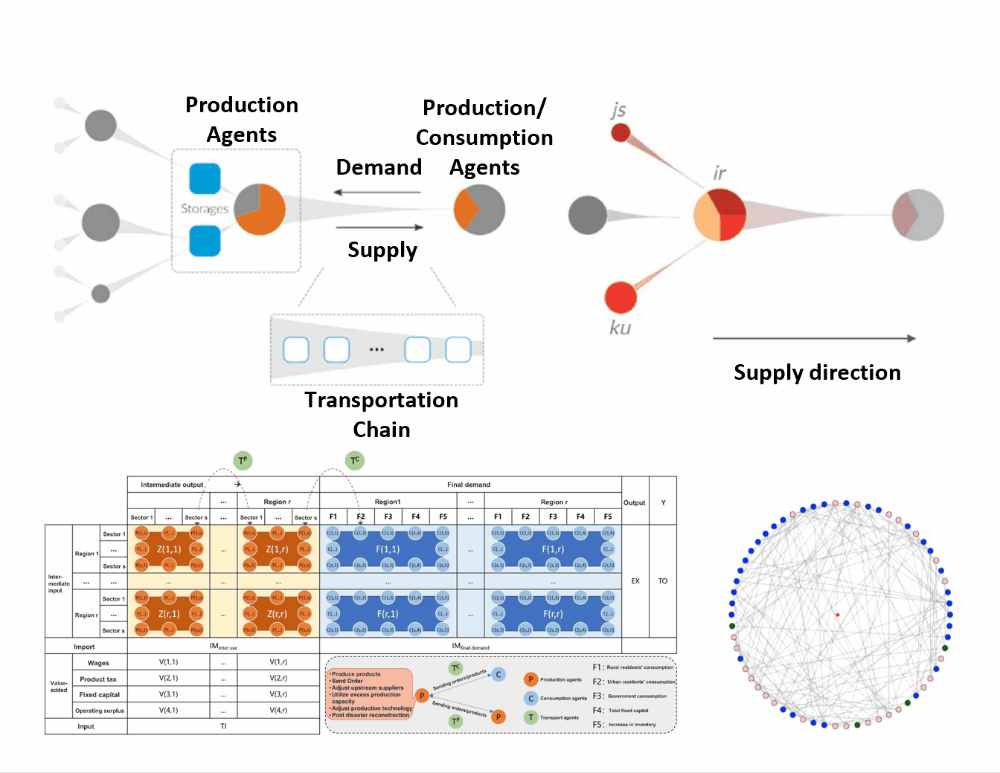


# CLUES ABM Model


# 1. Overview

The CLUES ABM model (Climate-resilient & Low-carbon Unfolding Economic Scenarios – An Agent-Based Model) simulates the short-term impact of abrupt external shocks on an equilibrium economic–environmental system, containing the process of adaptation and mitigation of agents within the system. The model unfolds economic and environmental system changes over time, allowing high-temporal and spatial resolution simulations for short and medium-term periods. It couples global environmental changes with China's socio-economic system at a high spatial-temporal precision, simulating the diffusion of environmental risks, natural disasters, and policy changes. This model helps to assess economic and environmental impacts more accurately, identify risk nodes, and design adaptive policies.

Figure 1 illustrates the simulation process of the CLUES-ABM model. Within a predefined world (such as China or globally), based on the supply-demand in the industrial chain, production agents and production/consumption agents transfer information or material via transportation agents. The transmission of material and information flows is determined by the initial world and the adaptive behavior of various agents, spreading and diffusing through the supply chain network.



**To be supplemented: 1 link points to the second library**

# 2. Function Introduction
The platform constructs an economic system model based on the interacting adaptive subjects in the industrial network. Through the integration of multi-source data, subject behavior rules and parallel computing technology，The platform is able to simulate the diffusion process of environmental risks, natural disasters, policy adjustments and other sudden events** in the economic system at a **high spatial and temporal resolution**, and to identify risk nodes and key transmission paths. Compared with traditional models, the platform can better reflect the real adaptive behavior and complexity characteristics of economic agents, thus providing a scientific basis for policy formulation.


**Application**：

(1) **Climate Change and Disaster Response** - Forecasting the impact of typhoons, floods, droughts and other disasters on the industrial chain and regional economy, and assessing the effects of emergency dispatch and recovery programs.<br>
(2) **Green Transformation and Emission Reduction Policy Evaluation** - simulate the impact of carbon tax, emission trading and other policies on industrial structure and enterprise adaptation behavior, and optimize the green transformation path.<br>
(3) **Public Health and Emergency Management** - analyze the dynamic impacts of epidemics and other public emergencies on production, logistics, and trade, and formulate collaborative response strategies.<br>
(4) **Macroeconomic Risk Early Warning** - Construct a "sensing system" for environmental and economic risks to support risk prevention, resilience enhancement and cross-sectoral collaborative governance.<br>

The platform can be used as an important tool for scientific research, governmental decision-making and corporate strategic analysis, and provides support for enhancing the adaptability and sustainability of China's socio-economic systems in the face of environmental change.

**Publications**：<br>
1，Qi Zhou, Shen Qu, Miaomiao Liu, Jianxun Yang, Jia Zhou, Yunlei She, Zhouyi Liu, Jun Bi, Enhancing the Efficiency of Enterprise Shutdowns for Environmental Protection: An Agent-Based Modeling Approach with High Spatial–Temporal Resolution Data, *Engineering*, **https://doi.org/10.1016/j.eng.2024.02.006**<br>
2，Wen Wen, Yang Su, Ying-er Tang, Xingman Zhang, Yuchen Hu, Yawen Ben, Shen Qu, Evaluating carbon emissions reduction compliance based on 'dual control' policies of energy consumption and carbon emissions in China, *Journal of Environmental Management*, **https://doi.org/10.1016/j.jenvman.2024.121990**.<br>
3，Qianzi Wang, Qi Zhou, Jin Lin, Sen Guo, Yunlei She, Shen Qu,
Risk assessment of power outages to inter-regional supply chain networks in China, *Applied Energy*, **https://doi.org/10.1016/j.apenergy.2023.122100**.<br>
4，Liping Wang, Zhouyi Liu, Yunlei She, Yiyi Cao, Mimi Gong, Meng Wang, Shen Qu. Exploring the network structure of virtual water trade among China's cities. *Journal of Environmental Management* 2025, 388 , 125968. https://doi.org/10.1016/j.jenvman.2025.125968 <br>
5，Y She, J Chen, Q Zhou, L Wang, K Duan, R Wang , Evaluating losses from water scarcity and benefits of water conservation measures to intercity supply chains in China，*Environmental science & technology*, 2024<br>
6，Yiyi Cao, Yunlei She, Qianzi Wang, Jin Lin, Weiming Chen, Shen Qu, Zhouyi Liu,
Redefining virtual water allocation in China based on economic welfare gains from environmental externalities, *Journal of Cleaner Production*, **https://doi.org/10.1016/j.jclepro.2023.140243**.<br>
7，Kun Zhang, Yiyi Cao, Zhouyi Liu, Qi Zhou, Shen Qu, Yi-Ming Wei,
Allocation of carbon emission responsibility among Chinese cities guided by economic welfare gains: Case study based on multi-regional input-output analysis, Applied *Energy*, **https://doi.org/10.1016/j.apenergy.2024.124252.**<br>
...

# 3. Quick Start
## 3.1 Environmental Preparation
  •	  Python ≥ 3.9（Recommend 3.9–3.11）
  •	  Recommended for virtual environments（```conda```or ```venv```）

The code is as follows：

```c
# Create a virtual environment (either one)
conda create -n clues-abm python=3.10 -y && conda activate clues-abm
# Or
python -m venv .venv && source .venv/bin/activate  # Windows: .venv\Scripts\activate
```
安装依赖：
```c
pip install solara numpy matplotlib
#If the repository has requirements.txt：
pip install -r requirements.txt
```
## 3.2 Get Code
The code is as follows：
```c
git clone https://github.com/WaterAI-bit/CLUES_ABM.git
cd CLUES_ABM
```
## 3.3 Model Background & Core Architecture
CLUES ABM is a **Dynamic Complex Network Model** based on adaptive agents that simulates the evolution of multiregional economic systems under external shocks, and is particularly suitable for assessing supply chain impacts of climate change adaptation and mitigation.

 - **Behavioral  network data**<br>
&emsp; &emsp; Multi-regional input-output tables（eg. ```MRIOExample.json```）<br>
&emsp; &emsp; Enterprise Network Business Database<br>
&emsp; &emsp; Trade network data compiled by individuals<br>

 - **Subject type**<br>
 &emsp; &emsp; Production node (enterprise)<br>
 &emsp; &emsp; Consumption node<br>
 &emsp; &emsp; Transport node<br>

 - **Adaptive behavior**<br>
&emsp; &emsp; Overproduction Capacity<br>
&emsp; &emsp; Inventories<br>
&emsp; &emsp; Trade Adaptation<br>
&emsp; &emsp; Production Adaptation<br>
&emsp; &emsp; Reconstruction<br>
 - **Program structure**<br>
&emsp; &emsp; object-oriented programming（OOP）<br>
&emsp; &emsp; core category：<br>
&emsp; &emsp; &emsp; &emsp;	World<br>
&emsp; &emsp; &emsp; &emsp;	AgentProduction<br>
&emsp; &emsp; &emsp; &emsp;	AgentConsumption<br>
&emsp; &emsp; &emsp; &emsp;	AgentTransportation<br>
 - **Simulation cycle** (for example, 365 days a year)：<br>
&emsp; &emsp;Renewal of environmental and policy constraints<br>
&emsp; &emsp;Connecting subjects (establishing interactions)<br>
&emsp; &emsp;Main actions：<br>
&emsp; &emsp; &emsp; &emsp;Production body: production → preparing products → preparing orders → adaptation → memorization<br>
&emsp; &emsp; &emsp; &emsp;Consumption subjects: consumption → preparation of orders → memorization<br>
&emsp; &emsp;Go to next day<br>

Understanding this structure helps to customize the configuration with scenario impact

## 3.4 Interactive operation
Run it in the project root directory:
```c
solara run app.py
```
The browser opens an interactive interface that supports a visual view of the simulation.

## 3.5 Script Running
Run in the project root directory：
```c
# Note the space in the filename
python "example 1 basic run.py"
```
Script flow:
<br>
(1) Load the data (e.g. ``cMRIOExample.json``)<br>
(2) Set simulation parameters (time step ```delta_t```, total days ```day_total```, target days ```ndays_target_default```)<br>
(3) Initialize subjects (production, consumption, transport)<br>
(4) Injecting scenario shocks (modifying ```AgentsP_Theta```to simulate capacity declines)<br>
(5) Advancing through the cycle (flow of goods → subject decisions → memory update)<br>
(6) Record results (value added changes, network flows, scarcity, etc.)<br>
(7) Plotting/saving (line graphs + ``.npz`` result files)<br>


After running: <br>
&emsp; &emsp;A daily Gross Value Added line chart will pop up <br>
&emsp; &emsp;Optionally, save the results to ```TestResults_ReductionInProductionCapacityExample.npz```.<br>
The browser will open an interactive interface that supports visual viewing of the simulation.

## 3.6 Adjustable Configurations and Variables<br>

  • 	```MRIOExample.json```：Multi-regional input-output data（```MRIO_R```、```MRIO_S```、```MRIO_Z```、```MRIO_C```、```MRIO_VA```etc.）<br>
   •	Simulation step and duration： ```delta_t = 1/365```，```day_total = 365```，```ndays_target_default = 3```<br>
   •	Impact settings (modified directly within the example script)： <br>
   •	Setting ``AgentsP_Theta`` for some production agents in a specified number of day intervals to simulate a drop in capacity<br>
   •	Transportation chain length/mapping:<br>
   •	Control of cargo flow propulsion and unloading positions through ``AgentsT_*`` with index ``k_NetPP / k_NetPC``.<br>
   •	Main output variables:<br>
&emsp; &emsp;Change in value added at regional/agent level<br>
&emsp; &emsp;Changes in cross-regional product flows<br>
&emsp; &emsp;Scarcity indicators<br>
&emsp; &emsp;Percentage loss of value added<br>

## 3.7 Results Visualization

   - Interactive mode: browser visualization<br>
   - Scripting mode: terminal output + pop-up charts + optional ``.npz`` data file<br>
   


# 4. Output Description

## 4.1 Output Variables

1. **S0_Evolution_ValueAdded_ProductionAgents**: Evolution of value added by each production agent each step for one simulation period.
   - **Shape**: `(model.N_P, day_total)` where `model.N_P` represents the total number of production agents, and `day_total` is the total simulation days.

2. **S0_ProductInNetwork_Region**: Tracks product flow between each region every step. This variable is a 3D array where `S0_ProductInNetwork_Region[i, j, t]` represents the number of products flowing from region `i` to region `j` on day `t`.
   - **Shape**: `(model.MRIO_R, model.MRIO_R, day_total)` where `model.MRIO_R` represents the total number of regions.

3. **S0_ProductInNetwork_Region_Change**: Tracks changes in product flow between regions relative to the initial state `SS_ProductInNetwork_Region`. `S0_ProductInNetwork_Region_Change[i, j, t]` represents the change in product flow from region `i` to region `j` on day `t` compared to the initial state.
   - **Shape**: `(model.MRIO_R, model.MRIO_R, day_total)`

4. **S0_Evolution_Scarcity_RegionsProducts**: Tracks the scarcity level of each product in each region every step. `S0_Evolution_Scarcity_RegionsProducts[i, k, t]` represents the scarcity level of product `k` in region `i` on day `t`.
   - **Shape**: `(model.MRIO_R, model.Sa, day_total)` where `model.Sa` represents the total number of products.


## 4.2 Post-Processing Variables (Calculated after Loops)

1. **S0_Evolution_ValueAdded_Region**  
   Tracks the total Value Added evolution for each region every step. It is derived by aggregating `S0_Evolution_ValueAdded_ProductionAgents` by region.
   - **Shape**: `(model.MRIO_R, day_total)`  
   Where `model.MRIO_R` represents the total number of regions, and `day_total` is the total number of simulation days.

2. **S0_LossPerc_ProductionAgents**  
   Tracks the loss percentage in Value Added for each production agent relative to its initial state. Only production agents with initial Value Added greater than 1e-4 are considered for the loss percentage.
   - **Shape**: `(model.N_P, 1)`  
   Where `model.N_P` represents the total number of production agents.

3. **S0_LossPerc_Region**  
   Tracks the loss percentage in Value Added for each region relative to its initial state. Only regions with initial Value Added greater than 1e-4 are considered for the loss percentage.
   - **Shape**: `(model.MRIO_R, 1)`  
   Where `model.MRIO_R` represents the total number of regions.

4. **S0_ProductInNetwork_Region_Change_Mean**  
   Tracks the average product flow change between regions, calculated by averaging `S0_ProductInNetwork_Region_Change` over the time dimension.
   - **Shape**: `(model.MRIO_R, model.MRIO_R)`  
   Where `model.MRIO_R` represents the total number of regions.

> **Note**: Based on the above variables, we can deduce the total and indirect losses (i.e., total losses minus direct losses) for each production agent and each region, both daily and on average.

# 5. Model Principles

The model is an agent-based model for simulating the evolution of an input-output system which can either be monetary or physical, single- or multi-regional. The modeled scenarios can unfold at relatively fine temporal scales (such as days).

Given enough data and computing power, this agent-based model can be applied to any input-output system with many producers, consumers, and transporters. Below we assume, as in Multi-Regional Input-Output (MRIO) models, there are r = 1, ⋯, R regions and s = 1, ⋯, S sectors in each region. Each region-sector is represented by a production agent `⟨P⟩(r,s)`. The final consumption in each region is represented by a consumption agent `⟨C⟩(r)`. The transportation agent from production agents `⟨P⟩(r₁,s₁)` to `⟨P⟩(r₂,s₂)` is `⟨T⟩^(→⟨P⟩)(r₁,s₁,r₂,s₂)`, shipping the relevant intermediate product, and the transportation agent from the production agent `⟨P⟩(r₁,s₁)` to the consumption agent `⟨C⟩(r₂)` is `⟨T⟩^(→⟨C⟩)(r₁,s₁,r₂)`, shipping the final product to consumers in region r₂.

The specific behaviors and corresponding micro-foundations of the these agents including production agents, consumption agents, and transportation agents are detailed here. According to the classification, the behavior mechanism of each agent is introduced in detail.

## 5.1 Production agent

***Production agent*** `⟨P⟩(r,s)` carries out the production and sends products and orders to other connected agents in the supply network in each simulation step. If external shocks (such as shortage of raw materials and/or loss of production capacity) occur, they can show certain adaptive behaviors, such as replenishing inventory, adjusting the order shares of upstream suppliers, using idle production capacity, adjusting production technology, post-disaster reconstruction, etc. Below we detail each type of behavior of this agent `⟨P⟩(r,s)` in one simulation step (e.g., one day).

### 1) Producing goods using the Leontief production function

The production is based on the Leontief production function and is limited by the total order, production capacity, and raw material supply:

$$
X^{a} = \min\{O^{tot}, X^{cap}, \min\{X^{s'}\}, \min\{X^{r', s'}\}\} \quad (1)
$$

$$
X^{a} = \min \left\{ O^{tot}, X^{cap}, \min \left\{ X^{s^{\prime}} \right\}, \min \left\{ X^{r^{\prime}, s^{\prime}} \right\} \right\} \quad (1)
$$


```math
X^{a} = \min \left\{ O^{tot}, X^{cap}, \min \left\{ X^{s^{\prime}} \right\}, \min \left\{ X^{r^{\prime}, s^{\prime}} \right\} \right\} \quad (1)
```
