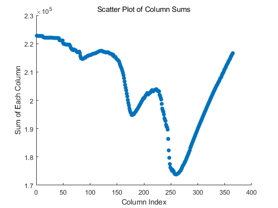

# CLUES-ABM MATLAB Implementation Base

This subdirectory contains the high-performance Matlab implementation of the **CLUES-ABM** core engine. 

---

## 📂 Subdirectory Architecture

* **`+clues_abm/`**: The standard Matlab module library.
  * `WorldOfMatrix_GPU.m`: Core computational matrix model governing large-system agent communications.
* **`data/`**: Input file repository.
  * `MRIOExample.mat`: Sample Multi-Regional Input-Output dataset formatted for tensor bootstrapping.
* **`output/`**: Execution matrix cache.
  * `TestResults_ReductionInProductionCapacityExample0.mat`: Multi-dimensional simulation state arrays.
* **`example_1_basic_run.m`**: A lightweight, headless batch-processing Matlab script optimized for server side deployments.

---

## ⚙️ Environment Prerequisites & Quick Start

### 1. Prerequisites
* **MATLAB** ($\ge$ R2020a recommended, with Parallel Computing Toolbox if executing on GPU layers).
* No external language dependencies (e.g., Python) or wrappers are required.

### 2. Quick Start
1. Open MATLAB and navigate to this subdirectory (ensure `+clues_abm` is visible in your Current Folder, but do not enter it).
2. Open and run `example_1_basic_run.m` to instantly execute the dynamic multi-regional spatiotemporal simulation and archive the metrics into the `output/` directory.

---

## 🚀 Quick Start & Code Demonstration

You can instantly deploy and verify the model directly within MATLAB using the canonical workflow below.

```matlab
%% 1. Environment & Package Initialization
import clues_abm.*

% Ensure the output directory exists to avoid write errors
if ~exist('output', 'dir')
    mkdir('output');
end

%% 2. Load Benchmarking Dataset
% Synthetic benchmarking dataset provided for demonstration purposes only.
load('data/MRIOExample.mat');

%% 3. Global Hyperparameters Configuration
delta_t = 1/365;               % Length of each time step as a fraction of input flows
day_total = 365;             % Total simulation period (1 Earth Year)
ndays_Target_Default = 3;    % Default targeted inventory periods (must be >= 1)

% Generate transport latency matrix (Default: 3 steps inter-region, 1 step intra-region)
MRIO_Dist = 3 * ones(R_MRIOExample, S_MRIOExample);
for i = 1:R_MRIOExample
    MRIO_Dist(i,i) = 1;
end
clear i;
MRIO_Dist = MRIO_Dist - 1;   % Calibrate to intermediate transportation line steps

% Initialize unit water intensity vector for environmental coupling
% Note: At least 1 water intensity should be nonzero to avoid computational error.
AgentsP_WaterIntensity = ones(R_MRIOExample * S_MRIOExample, 1); 

%% 4. Multi-Agent Environment Setup
GlobalEcon = clues_abm.WorldOfMatrix_GPU; % China's economy is our World.

% Inject MRIO Structural Arrays
GlobalEcon.MRIO_R = R_MRIOExample; 
GlobalEcon.MRIO_S = S_MRIOExample; 
GlobalEcon.MRIO_Z = Z_MRIOExample; 
GlobalEcon.MRIO_C = C_MRIOExample; 
GlobalEcon.MRIO_VA = VA_MRIOExample; 
GlobalEcon.OpenEcon = false;       % Global economy is closed
GlobalEcon.S2Sa = eye(S_MRIOExample); 

% Bind Control Parameters
GlobalEcon.delta_t = delta_t;
GlobalEcon.ndays_Target_Default = ndays_Target_Default;
GlobalEcon.MRIO_Dist = MRIO_Dist;
GlobalEcon.AgentsP_WaterIntensity = AgentsP_WaterIntensity;

% Multi-Agent Topology Initialization
tic; GlobalEcon = GlobalEcon.InitializeBasicVariables_UsingMRIO;     
tic; GlobalEcon = GlobalEcon.InitializeProductionAgents_UsingMRIO;  
tic; GlobalEcon = GlobalEcon.InitializeConsumptionAgents_UsingMRIO; 
tic; GlobalEcon = GlobalEcon.InitializeTransportationAgents_UsingMRIO; 
fprintf('-> Model initialization success.\n');

%% 5. Pre-allocate Tracking Matrices
S0_Evolution_ValueAdded_ProductionAgents = zeros(GlobalEcon.N_P, day_total);
SS_AgentsP_VA = GlobalEcon.AgentsP_VA;
RegionSectors2Regions = kron(eye(GlobalEcon.MRIO_R), ones(GlobalEcon.MRIO_S, 1));
SS_Provinces_VA = RegionSectors2Regions' * SS_AgentsP_VA;

S0_ProductInNetwork_Provinces = zeros(GlobalEcon.MRIO_R, GlobalEcon.MRIO_R, day_total);
S0_ProductInNetwork_Provinces_Change = zeros(GlobalEcon.MRIO_R, GlobalEcon.MRIO_R, day_total);
SS_ProductInNetwork_Provinces = RegionSectors2Regions' * GlobalEcon.AgentsP_ProductInP * RegionSectors2Regions;
S0_Evolution_Scarcity_RegionsProducts = zeros(GlobalEcon.MRIO_R, GlobalEcon.Sa, day_total);

%% 6. Spatiotemporal Simulation Loop & Policy Shocks
fprintf('Unfolding dynamic eco-environmental scenarios...\n');

for day = 1:day_total
    disp(day);
    
    % --- Dynamic Spatiotemporal Policy Shocks (Adaptive Slicing) ---
    % Days 1–30: Region 1, Sectors 1–20 experience a 20% capacity reduction (theta = 0.2)
    if (day >= 1) && (day <= 30)
        GlobalEcon.AgentsP_Theta(1:20) = 0.2;  
    end
    
    % Days 100–130: Region 2, Sectors 21–40 experience a 30% capacity reduction (theta = 0.3)
    if (day >= 100) && (day <= 130)
        GlobalEcon.AgentsP_Theta(77:96) = 0.3;
    end
    
    % Days 200–230: Region 5, Sectors 49–56 experience a 40% capacity reduction (theta = 0.4)
    if (day >= 200) && (day <= 230)
        GlobalEcon.AgentsP_Theta(273:280) = 0.4;
    end

    % --- Transportation & Logistics Layer Movements ---
    GlobalEcon.AgentsT_P2P = [ zeros(GlobalEcon.nl_NetPP, 1), GlobalEcon.AgentsT_P2P ];
    GlobalEcon.AgentsT_P2P(GlobalEcon.AgentsT_P2P_StartLinInd) = GlobalEcon.AgentsP_ProductOutP(GlobalEcon.k_NetPP);
    GlobalEcon.AgentsT_P2C = [ zeros(GlobalEcon.nl_NetPC, 1), GlobalEcon.AgentsT_P2C ];
    GlobalEcon.AgentsT_P2C(GlobalEcon.AgentsT_P2C_StartLinInd) = GlobalEcon.AgentsP_ProductOutC(GlobalEcon.k_NetPC);  

    temp = GlobalEcon.AgentsP_ProductInP';
    temp(GlobalEcon.k_NetPP) = GlobalEcon.AgentsT_P2P(:, end);
    GlobalEcon.AgentsP_ProductInP = temp';
    GlobalEcon.AgentsT_P2P(:, end) = [];
    
    temp = GlobalEcon.AgentsC_ProductInP';
    temp(GlobalEcon.k_NetPC) = GlobalEcon.AgentsT_P2C(:, end);
    GlobalEcon.AgentsC_ProductInP = temp';
    GlobalEcon.AgentsT_P2C(:, end) = [];
    clear temp;
    
    % --- Automated Multi-Agent Decisions & Micro-Behaviors ---
    GlobalEcon = GlobalEcon.AgentsCommunicate;    
    GlobalEcon = GlobalEcon.UpdateInventories;   
    GlobalEcon = GlobalEcon.UpdateExportOrders;
    GlobalEcon = GlobalEcon.UpdateShares;
    GlobalEcon = GlobalEcon.ProductionAgentsProduce;
    GlobalEcon = GlobalEcon.ProductionAgentsPrepareProductOut;
    GlobalEcon = GlobalEcon.ProductionAgentsPrepareOrderOut;
    GlobalEcon = GlobalEcon.ProductionAgentsAdaptToShocks;
    GlobalEcon = GlobalEcon.ProductionAgentsAdaptToShortages;
    GlobalEcon = GlobalEcon.ProductionAgentsRemember;
    GlobalEcon = GlobalEcon.ConsumptionAgentsConsume;
    GlobalEcon = GlobalEcon.ConsumptionAgentsPrepareOrderOut;
    GlobalEcon = GlobalEcon.ConsumptionAgentsRemember;
    
    % --- State Variables Archiving ---
    S0_Evolution_ValueAdded_ProductionAgents(:, day) = GlobalEcon.AgentsP_VA;
    S0_ProductInNetwork_Provinces(:, :, day) = RegionSectors2Regions' * GlobalEcon.AgentsP_ProductInP * RegionSectors2Regions;
    S0_ProductInNetwork_Provinces_Change(:, :, day) = S0_ProductInNetwork_Provinces(:, :, day) - SS_ProductInNetwork_Provinces;
    S0_Evolution_Scarcity_RegionsProducts(:, :, day) = GlobalEcon.Scarcity_RegionsProducts;
end

%% 7. Post-Simulation Metrics Calculation
S0_Evolution_ValueAdded_Provinces = RegionSectors2Regions' * S0_Evolution_ValueAdded_ProductionAgents;

S0_LossPerc_ProductionAgents = zeros(GlobalEcon.N_P, 1);
ind = SS_AgentsP_VA > 10^(-4);
S0_LossPerc_ProductionAgents(ind) = 100 * (SS_AgentsP_VA(ind) - mean(S0_Evolution_ValueAdded_ProductionAgents(ind, :), 2)) ./ SS_AgentsP_VA(ind);

S0_LossPerc_Provinces = zeros(GlobalEcon.MRIO_R, 1);
ind = SS_Provinces_VA > 10^(-4);
S0_LossPerc_Provinces(ind) = 100 * (SS_Provinces_VA(ind) - mean(S0_Evolution_ValueAdded_Provinces(ind, :), 2)) ./ SS_Provinces_VA(ind);

S0_ProductInNetwork_Provinces_Change_Mean = mean(S0_ProductInNetwork_Provinces_Change, 3);

%% 8. Save Metrics Matrix to Disk
save('output/TestResults_ReductionInProductionCapacityExample0.mat', ...
   'S0_Evolution_ValueAdded_ProductionAgents', 'S0_Evolution_ValueAdded_Provinces', ...
   'S0_ProductInNetwork_Provinces', 'S0_ProductInNetwork_Provinces_Change', 'S0_ProductInNetwork_Provinces_Change_Mean', ...
   'S0_LossPerc_ProductionAgents', 'S0_LossPerc_Provinces', ...
   'S0_Evolution_Scarcity_RegionsProducts', ...
   'SS_AgentsP_VA', 'SS_Provinces_VA', 'SS_ProductInNetwork_Provinces', ...
   'RegionSectors2Regions');

%% 9. Quick Visualization Verification
col_sum = sum(S0_Evolution_ValueAdded_ProductionAgents, 1);
x = 1:length(col_sum); y = col_sum;           
scatter(x, y, 'filled');        
xlabel('Simulation Timeline (Days)'); ylabel('Sum of Production Value-Added');
title('System Dynamic Resilience Scatter Tracker');
```

## 📊 Expected Simulation Results

When you run the standalone workflow above, the core matrix engine dynamically tracks the multi-regional spatiotemporal cascading losses. The compiled metrics and topological network resilience curves are automatically rendered and archived into the `output/` directory as `result_plot.png`.

Below is the verified timeline response capturing the system's macroeconomic output fluctuations under targeted regional capacity shocks:

<p align="center">
  
  <br>
  <em>Figure: System-wide value-added recovery and resilience trajectory under multi-stage adaptive shocks.</em>
</p>

> 💡 **User Note:** Since GitHub natively renders relative paths within repositories, as long as `result.png` exists in your locally committed or pushed `output/` folder, the chart above will display beautifully and flawlessly right on your repository's homepage.


